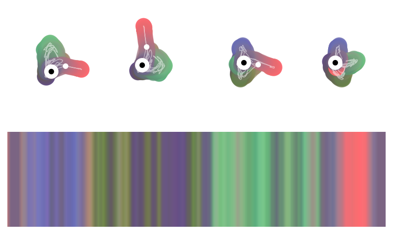

# `gauge`

Hi.


## Usage

```bash
./scripts/boo.sh program 256
```

## Example on data stream




## TODO

- Periodic approach of visualization [week by week]:
    - implication ~ blocked processing
    - mitigation ~ progress indication
    - stable [time-coded] (?) 